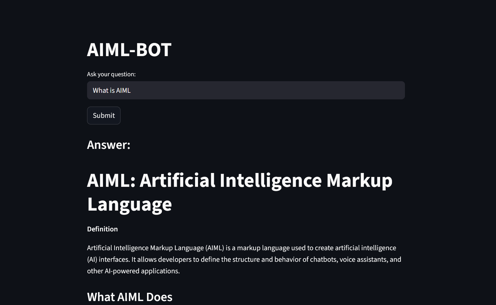

# 📘 RAG Chatbot: Machine Learning Knowledge Assistant
## 📷 Preview

## Overview

    This project contains a Retrieval-Augmented Generation (RAG) chatbot built using LangChain, HuggingFace embeddings, ChromaDB, Ollama, and Streamlit. It allows users to ask Artificial intelligence - Machine learning related questions, and the chatbot responds using information extracted from a custom .md datasets.

## Dataset

There are three datasets consists of:

    - A markdown file (machine_learning_dataset.md) containing machine learning definitions, algorithms, and explanations and related concepts like evaluation metrics, errors, etc.

    - A markdown file (deep_learning_dataset.md) containing deep learning definitions, algorithms, and explanations and related concepts like evaluation metrics, backpropagation, etc.

    - A markdown file (AI_dataset.md) containing Artificial intelligence definitions, algorithms, and explanations and related concepts like Natural language processing, computer vision, etc.

## Implementation

The following steps were carried out in this project:

1. Data Preprocessing:

    - Removal of HTML tags, punctuation, URLs
    - Text normalization to lowercase

2. Chunking:

    - Used MarkdownTextSplitter to break the dataset into overlapping chunks for all the three datasets. 

3. Embedding:

    - Generated vector embeddings for all the three dataset's chunks using all-MiniLM-L6-v2 from HuggingFace
    -  Created a descritption lists for ML,DL and AI and generated their vectors using the same embedding adn stored them using joblib.

4. Vector Storage:

    - Stored embeddings in ChromaDB for similarity search

5. Model Integration:

    - Connected a local Llama 3 model using Ollama

6. RAG Pipeline:

    - Implemented RetrievalQA chain to fetch relevant chunks and generate responses

## Results

We created a chatbot capable of:

    - finding the similarity between asked query and and the three dataset files to choose the relevant dataset file.
    - Retrieving relevant AI-ML content from the respective file.
    - Generating structured answers using headings, bullet points, and clean formatting.
    - Running entirely offline using a local LLM.

A separate file (AIML.py) is created to deploy the chatbot as a Streamlit web app.

## Usage
1. Clone the repository
    git clone <repo-url>
    cd <repo-folder>

2. Run the RAG chatbot
Make sure Ollama is running in the background, then execute:
    streamlit run AIML.py
The app will launch in your browser.

## Dependencies

Check the requirement.txt for the list of modules and libraries.

## Conclusion

    This project demonstrates how to build a complete RAG-based AI assistant using local models. It provides structured, accurate answers to AI-ML questions and serves as a strong foundation for more advanced AI applications.

## License

This project is open-source and available for modification and reuse.

## Author

Shivani Lange
