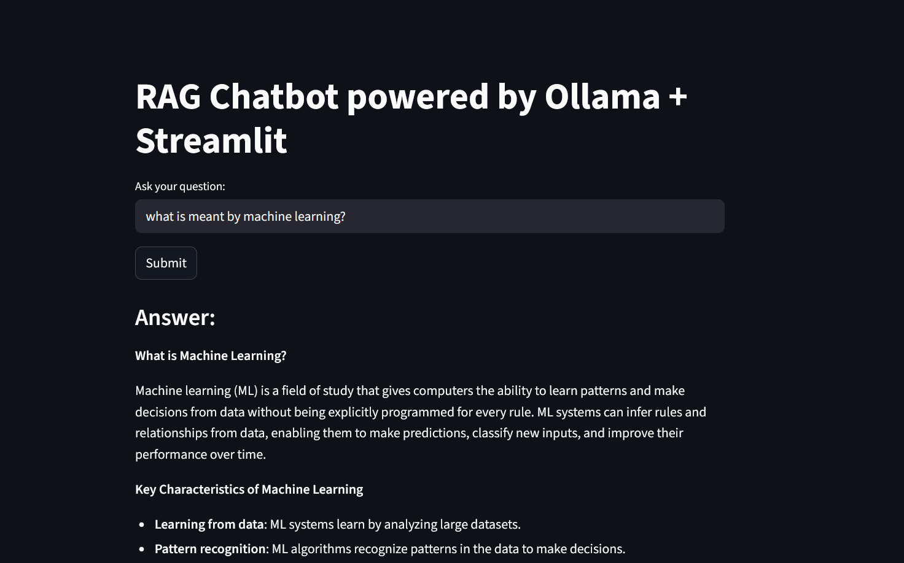

# 📘 RAG Chatbot: Machine Learning Knowledge Assistant
## 📷 Preview

## Overview

    This project contains a Retrieval-Augmented Generation (RAG) chatbot built using LangChain, HuggingFace embeddings, ChromaDB, Ollama, and Streamlit. It allows users to ask machine-learning-related questions, and the chatbot responds using information extracted from a custom .md dataset.

## Dataset

The dataset consists of:

    - A markdown file (machine_learning_dataset.md) containing machine learning definitions, algorithms, and explanations and related concepts like evaluation metrics, errors, etc.

    - Preprocessed text split into multiple chunks for vector storage and retrieval.

## Implementation

The following steps were carried out in this project:

1. Data Preprocessing:

    - Removal of HTML tags, punctuation, URLs
    - Text normalization to lowercase

2. Chunking:

    - Used MarkdownTextSplitter to break the dataset into overlapping chunks

3. Embedding:

    - Generated vector embeddings using all-MiniLM-L6-v2 from HuggingFace

4. Vector Storage:

    - Stored embeddings in ChromaDB for similarity search

5. Model Integration:

    - Connected a local Llama 3 model using Ollama

6. RAG Pipeline:

    - Implemented RetrievalQA chain to fetch relevant chunks and generate responses

## Results

We created a chatbot capable of:

    - Retrieving relevant machine-learning content
    - Generating structured answers using headings, bullet points, and clean formatting
    - Running entirely offline using a local LLM

A separate file (qa_app.py) is created to deploy the chatbot as a Streamlit web app.

## Usage
1. Clone the repository
    git clone <repo-url>
    cd <repo-folder>

2. Run the RAG chatbot
Make sure Ollama is running in the background, then execute:
    streamlit run app.py
The app will launch in your browser.

## Dependencies

Check the requirement.txt for the list of modules and libraries.

## Conclusion

    This project demonstrates how to build a complete RAG-based AI assistant using local models. It provides structured, accurate answers to machine learning questions and serves as a strong foundation for more advanced AI applications.

## License

This project is open-source and available for modification and reuse.

## Author

Shivani Lange
